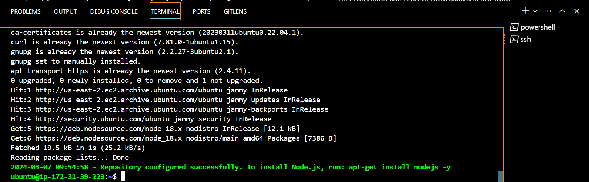
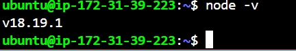
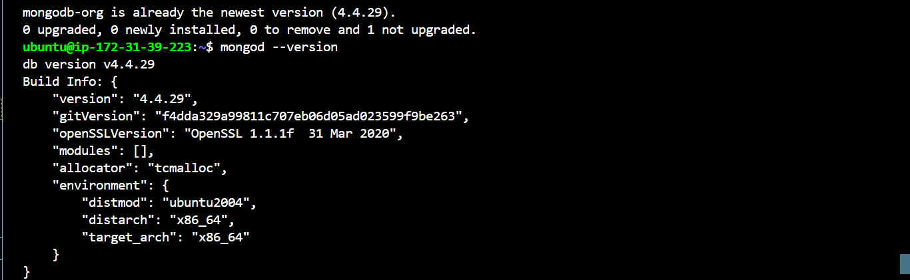
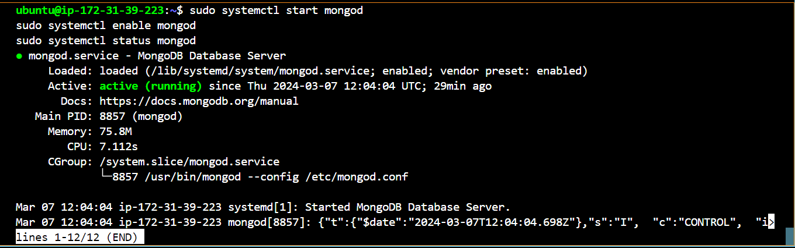
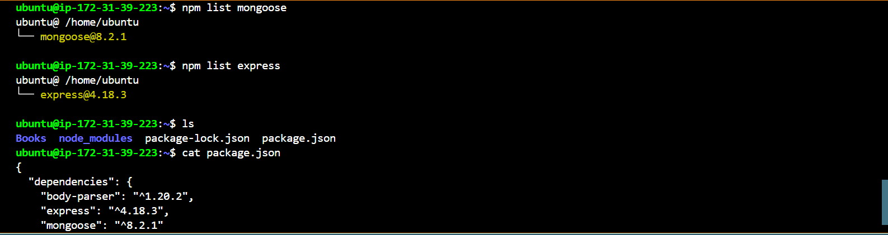

# **Objective**
- **Implementing a simple Book Register web form using MEAN STACK on Ubuntu Server deployed on AWS**

**Goodluck 👍 🥰**

```
sudo apt update
```
```
sudo apt upgrade
```

- **Add certificates**

SSL/TLS certificates play a critical role in ensuring the security, authentication, privacy, and trustworthiness of websites on the internet, making them essential for safeguarding sensitive online transactions and communications.

```
sudo apt -y install curl dirmngr apt-transport-https lsb-release ca-certificates
```
***curl:*** A command-line tool for transferring data using various network protocols.

***dirmngr:*** A server for managing and downloading OpenPGP keys from key servers.

***apt-transport-https:*** A package that allows apt to fetch packages over HTTPS.

***lsb-release:*** A package providing information about the Linux Standard Base (LSB) release.

***ca-certificates:*** A package containing public CA certificates used for verifying the authenticity of SSL connections.
```
curl -sL https://deb.nodesource.com/setup_18.x | sudo -E bash -:
```
This command uses curl to download a script from https://deb.nodesource.com/setup_18.x.

***The -s flag*** tells curl to work silently without showing progress or errors.

***The -L*** flag tells curl to follow HTTP redirects if the server responds with a redirect.

The downloaded script is then piped (|) to bash, a shell interpreter, to be executed.

***The -E flag*** for sudo preserves the user's environment when running the subsequent command (bash -).

This script adds the NodeSource repository for Node.js to the system's package sources, making it possible to install Node.js version 12.x using apt after this setup.

***In summary, these commands install some prerequisite packages required for package management and then set up the Node.js repository for installing Node.js version 12.x on the Ubuntu system.***



- **Install NodeJs**

Node.js is a JavaScript runtime built on Chrome’s V8 JavaScript engine. Node.js is used in this tutorial to set up the Express routes and AngularJS controllers.
Update Ubuntu.
```
sudo apt install -y nodejs
```


- **Install MongoDB**

MongoDB stores data in flexible, JSON-like documents. Fields in a database can vary from document to document and data structure can be changed over time. application, we are adding book records to MongoDB that contain book 
1. name 
2. isbn number 
3. author
4. number of pages.
5. mages/WebConsole.gif

Run the following command:
```
sudo apt-key adv --keyserver hkp://keyserver.ubuntu.com:80 --recv 0C49F3730359A14518585931BC711F9BA15703C6
echo "deb [ arch=amd64 ] https://repo.mongodb.org/apt/ubuntu trusty/mongodb-org/3.4 multiverse" | sudo tee /etc/apt/sources.list.d/mongodb-org-3.4.list
```
***N/B: If you are using Ubuntu 22.04 the above script wont work, while MongoDB 4.4 does not natively support Ubuntu 22.04, there is a workaround that allows you to run it on your server. Follow the steps below:***

Install the Required Dependency: First, install libssl1.1, which is needed by MongoDB. Since there’s no direct install candidate for Ubuntu 22.04, we’ll add the package from the Ubuntu 20.04 repository:

```
echo "deb [arch=amd64] http://security.ubuntu.com/ubuntu focal-security main" | sudo tee /etc/apt/sources.list.d/focal-security.list
sudo apt update
sudo apt-get install libssl1.1
sudo rm /etc/apt/sources.list.d/focal-security.list
```
Add MongoDB Repository and Install MongoDB 4.4: Next, add the MongoDB key and repository for version 4.4:

```
curl -fsSL https://www.mongodb.org/static/pgp/server-4.4.asc | sudo apt-key add -
echo "deb [arch=amd64,arm64] https://repo.mongodb.org/apt/ubuntu focal/mongodb-org/4.4 multiverse" | sudo tee /etc/apt/sources.list.d/mongodb-org-4.4.list
sudo apt-get update
sudo apt-get install mongodb-org -y
```
Verify the Installation: Confirm that MongoDB 4.4 is installed:
```
mongod --version
```
You should see the output below on your terminal


Start MongoDB Service: Finally, start the MongoDB service:
```
sudo systemctl start mongod
sudo systemctl enable mongod
sudo systemctl status mongod
```


This code snippet performs the following actions:

- ***Importing MongoDB GPG key:***
```
sudo apt-key adv --keyserver hkp://keyserver.ubuntu.com:80 --recv 0C49F3730359A14518585931BC711F9BA15703C6
```
This command uses ***apt-key*** to download and import the GPG (GNU Privacy Guard) key for the MongoDB repository.

***The --keyserver flag:*** specifies the keyserver URL (hkp://keyserver.ubuntu.com:80) from which to retrieve the key.
***The --recv flag:*** specifies the key ID (0C49F3730359A14518585931BC711F9BA15703C6) of the MongoDB GPG key to import.

- ***Adding MongoDB repository to package sources:***
```
echo "deb [ arch=amd64 ] https://repo.mongodb.org/apt/ubuntu trusty/mongodb-org/3.4 multiverse" | sudo tee /etc/apt/sources.list.d/mongodb-org-3.4.list
```
This command appends a new repository entry to the /etc/apt/sources.list.d/mongodb-org-3.4.list file.
***The repository URL*** (https://repo.mongodb.org/apt/ubuntu) points to the MongoDB APT repository for Ubuntu.

***trusty:*** indicates the Ubuntu release codename (e.g., Trusty Tahr) for which this repository is intended.

***mongodb-org/3.4*** specifies the repository component and version of MongoDB to install (3.4 in this case).
***multiverse:*** indicates the repository section where MongoDB packages are located.

***In summary, these commands are used to add the MongoDB APT repository to the system's package sources and import the GPG key to verify package integrity when installing MongoDB packages via apt. This enables the system to install and update MongoDB using the standard package management tools provided by Ubuntu.***
```
sudo apt install -y mongodb
```
This command installs MongoDB on an Ubuntu system using the apt package manager. Here's what each part of the command does:

***sudo:*** This prefix is used to execute the following command with administrative privileges. It allows the user to perform actions that require superuser (root) access.

***apt:*** This is the package management tool used in Ubuntu and other Debian-based Linux distributions.

***install:*** This is the apt command used to install packages.

***-y:*** This option is used to automatically answer "yes" to all prompts. It's useful for scripting or when you want to proceed with the installation without manual confirmation.

***mongodb:*** This is the name of the package to be installed. In this case, it refers to the MongoDB package.

When you run this command, apt will download and install the MongoDB package along with any dependencies it requires. The -y option ensures that you won't be prompted to confirm the installation, so it will proceed automatically. 

***PS: The -y flag should be passed or used when installing a package from a known source, in order not to install unknown or unwanted packages.***

- **Install npm- Node package manager**

The Node Package Manager (npm) is the default package manager for Node.js, a JavaScript runtime environment. npm is a command-line tool that allows developers to install, manage, version, script, secure and share JavaScript packages and dependencies for Node.js projects.

```
sudo apt install -y npm 
```
N/B: If you have properly installed Node.js on your system, npm (Node Package Manager) typically comes bundled with it

- **Install body-parser package**

We need ‘body-parser’ package to help us process JSON files passed in requests to the server.

```
cat package.json | grep body-parser
```
The above command will search for the string ***"body-parser"*** in the package.json file. If body-parser is listed as a dependency, it will be displayed in the output.

In the Books directory, Initialize npm project
```
npm init
```
using your favourite commandline code editor, add a file to it named server.js
```
nano server.js
```
paste the code bellow
```
var express = require('express');
var bodyParser = require('body-parser');
var app = express();
app.use(express.static(__dirname + '/public'));
app.use(bodyParser.json());
require('./apps/routes')(app);
app.set('port', 3300);
app.listen(app.get('port'), function() {
    console.log('Server up: http://localhost:' + app.get('port'));
});
```


**INSTALL EXPRESS AND SET UP ROUTES TO THE SERVER**

Install Express and set up routes to the server.
Express is a minimal and flexible Node.js web application framework that provides features for web and mobile applications. We will use Express to pass book information to and from our MongoDB database.
We also will use Mongoose package which provides a straightforward, schema-based solution to model your application data. We will use Mongoose to establish a schema for the database to store data of our book register.
```
sudo npm install express mongoose
```
To check if mongoose and express are present as dependencies in your package.json file, run the following commands
```
npm list momgoose
npm list express
```
you can aswell cat your package.json file and check the dependencies session to see if mongoose and express are present.
```
cat package.json
```


In ‘Books’ folder, create a folder named apps
```
mkdir apps && cd apps
```
Create a file named routes.js
```
nano routes.js
```
paste the code below in the routes.js file

```
var Book = require('./models/book');
module.exports = function(app) {
  app.get('/book', function(req, res) {
    Book.find({}, function(err, result) {
      if ( err ) throw err;
      res.json(result);
    });
  }); 
  app.post('/book', function(req, res) {
    var book = new Book( {
      name:req.body.name,
      isbn:req.body.isbn,
      author:req.body.author,
      pages:req.body.pages
    });
    book.save(function(err, result) {
      if ( err ) throw err;
      res.json( {
        message:"Successfully added book",
        book:result
      });
    });
  });
  app.delete("/book/:isbn", function(req, res) {
    Book.findOneAndRemove(req.query, function(err, result) {
      if ( err ) throw err;
      res.json( {
        message: "Successfully deleted the book",
        book: result
      });
    });
  });
  var path = require('path');
  app.get('*', function(req, res) {
    res.sendfile(path.join(__dirname + '/public', 'index.html'));
  });
};
```
In the ‘apps’ folder, create a folder named models

```
mkdir models && cd models
```
Create a file named book.js
```
nano books.js
```
Copy and paste the code below into the ‘book.js’ file
```
var mongoose = require('mongoose');
var dbHost = 'mongodb://localhost:27017/test';
mongoose.connect(dbHost);
mongoose.connection;
mongoose.set('debug', true);
var bookSchema = mongoose.Schema( {
  name: String,
  isbn: {type: String, index: true},
  author: String,
  pages: Number
});
var Book = mongoose.model('Book', bookSchema);
module.exports = mongoose.model('Book', bookSchema);
```

- ### Access the routes with AngularJS


AngularJS is a JavaScript-based open-source front-end web framework developed and maintained by Google. in this project, I use AngularJS to connect the web page with Express and perform actions on our book register.
Angular is designed to simplify the development of dynamic web applications by providing a structured framework for building interactive and data-driven single-page applications (SPAs).

Change the directory back to Books
```
cd../..
```
Create a folder named public

```
mkdir public && cd public
```
Add a file named script.js
```
nano script.js
```
past the code below in the script.js file

```
var app = angular.module('myApp', []);
app.controller('myCtrl', function($scope, $http) {
  $http( {
    method: 'GET',
    url: '/book'
  }).then(function successCallback(response) {
    $scope.books = response.data;
  }, function errorCallback(response) {
    console.log('Error: ' + response);
  });
  $scope.del_book = function(book) {
    $http( {
      method: 'DELETE',
      url: '/book/:isbn',
      params: {'isbn': book.isbn}
    }).then(function successCallback(response) {
      console.log(response);
    }, function errorCallback(response) {
      console.log('Error: ' + response);
    });
  };
  $scope.add_book = function() {
    var body = '{ "name": "' + $scope.Name + 
    '", "isbn": "' + $scope.Isbn +
    '", "author": "' + $scope.Author + 
    '", "pages": "' + $scope.Pages + '" }';
    $http({
      method: 'POST',
      url: '/book',
      data: body
    }).then(function successCallback(response) {
      console.log(response);
    }, function errorCallback(response) {
      console.log('Error: ' + response);
    });
  };
});
```
